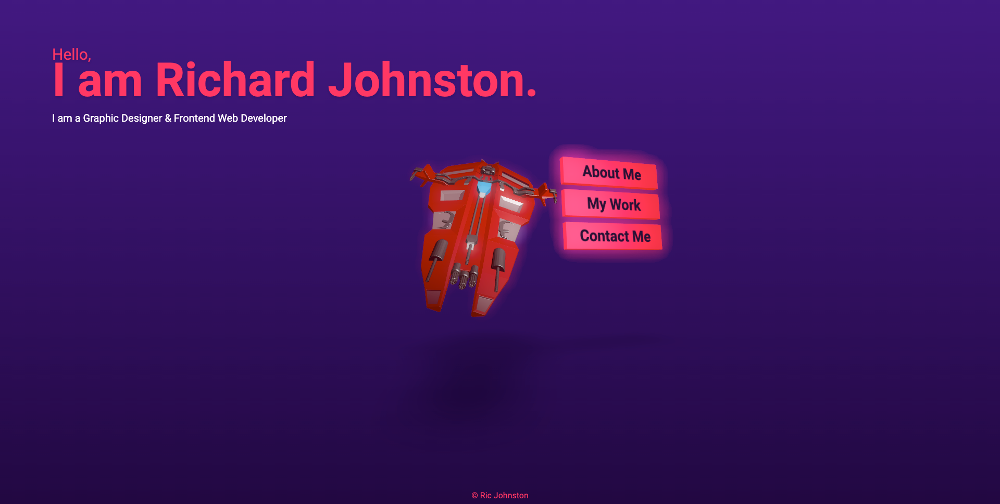

# React-portfolio

The thirteenth week challenge

## Description

Build a custom portfolio site using React. Containing links to github, LinkedIn, Email etc.

## Process

I built my portfolio website using React, threejs, & tailwindcss.
I found the tailwindcss similar to bootstrap in the sense that the styling is added to the elements. 
I used Threejs to add the 3D model and add interactivity to the model and menu system.

Site deployed on netlify: https://6425c0c97821c719b1a5561c--harmonious-truffle-eefac6.netlify.app/

